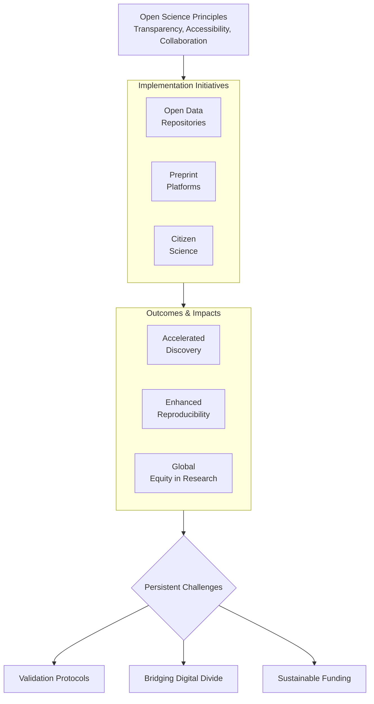

      

<h3 align="center">WELCOME TO</h3>
<h1 align="center">SR CYBER LABS</h1>
<h3 align="center">PRECISION IN EXECUTION - SUPREMACY IN IMPACT</h3>

  

    

  
 

<h1 align="center">DEMOCRATIZING INNOVATION: THE TRANSFORMATIVE IMPACT OF OPEN-SOURCE PHILOSOPHY ON SCIENTIFIC, ENGINEERING, AND TECHNOLOGICAL RESEARCH.</h1>

 

**Introduction:** The open-source philosophy, while born in the realm of software development, has evolved into a transformative paradigm reshaping the very fabric of global innovation. It represents a fundamental shift from a proprietary, siloed model of knowledge creation to one of radical transparency, collaborative ownership, and universal accessibility. This ethos systematically dismantles traditional barriers—proprietary licenses, institutional monopolies, and restrictive paywalls—to democratize participation in scientific discovery, engineering design, and technological advancement. From the foundational legal frameworks established by the Open Source Initiative (OSI) to UNESCO's global advocacy for Open Science, and from grassroots open-hardware collectives to decentralized artificial intelligence initiatives, open-source principles are catalyzing an era of accelerated, inclusive progress. It functions not merely as a technical methodology but as a potent catalyst for global equity, empowering a diverse spectrum of participants to scrutinize, iterate upon, and build upon research as a shared human commons.

 

**The Foundational Framework - Principles of Open Collaboration:** At its core, open-source challenges the prevailing notion of knowledge as a private commodity. The movement is underpinned by a robust ethical and legal scaffold, exemplified by the OSI’s ten criteria, which mandate free redistribution, source-code accessibility, and non-discriminatory licensing. These principles ensure that critical tools, datasets, and designs remain accessible public goods, enabling innovation without prohibitive legal or technical barriers.

The success of this framework is evident in iconic projects like the Linux kernel and the Apache HTTP Server, which demonstrate how decentralized, community-driven collaboration can surpass proprietary counterparts in scalability, security, and adaptive evolution. This model has successfully permeated beyond software, inspiring global policies like UNESCO’s Recommendation on Open Science, which mandates open access to publications, data, and infrastructure while recognizing the value of integrating diverse knowledge systems, including indigenous epistemologies. This reconceptualization of research as a communal asset actively redistributes authority from traditional gatekeepers to a globally engaged collective.

**Table 1: Core Tenets of the Open-Source Philosophy Across Domains**

| **Principle** | **Software (Origin)** | **Scientific Research** | **Engineering & Hardware** | **AI & Technology** |
| :--- | :--- | :--- | :--- | :--- |
| **Transparency** | Public source code | Open data, open peer review | Public schematics & blueprints | Open-model weights & training data |
| **Collaboration** | Global developer communities | Citizen science, collaborative papers | Co-design platforms (e.g., P2P Foundation) | Open-source AI communities |
| **Accessibility** | Free redistribution | Open-access journals, preprints | Low-cost, locally manufacturable designs | Publicly available AI models & tools |
| **Iterative Improvement** | Community bug fixes, patches | Reproducibility, meta-analyses | Rapid prototyping & versioning | Community fine-tuning & optimization |

 

**Democratizing Scientific Research - The Open Science Revolution:** Scientific inquiry, historically constrained within elite institutions, is undergoing a profound shift towards radical inclusivity. UNESCO’s 2023 Recommendation on Open Science explicitly positions open access as an essential public good, critical for addressing global crises like pandemics and climate change. Practical initiatives are the engines of this change:

*   **Open Data Repositories** (e.g., GenBank for genomic data) ensure foundational datasets are available to all.
*   **Preprint Platforms** (e.g., arXiv, bioRxiv) democratize the dissemination of findings, enabling researchers in under-resourced regions to contribute to global discourse.
*   **Citizen Science Projects** (e.g., Zooniverse) engage millions of volunteers in tasks from classifying galaxies to tracking biodiversity, merging public participation with academic rigor.

As emphasized by institutions like the World Bank, this openness enhances scalability, accountability, and reproducibility, as diverse input helps mitigate methodological bias. The primary challenges involve developing robust validation protocols for non-expert contributions and bridging the global digital divide to ensure equitable access to essential cyberinfrastructure.

 

**Engineering Research Democratized - The Open Hardware Movement:** Engineering innovation is experiencing a parallel revolution, moving from corporate R&D labs to global communities. Open-hardware movements democratize prototyping and manufacturing through the open sharing of detailed blueprints, schematics, and designs.

*   **Open-Source PDKs:** Process Design Kits from institutions like the University of Michigan enable startups and academics to design integrated circuits without costly proprietary tools.
*   **Collaborative Platforms:** Platforms like the P2P Foundation facilitate global communities in tackling challenges, from developing 3D-printed prosthetics to creating open-source environmental sensors.
*   **Participatory Co-Design:** This approach involves end-users in the design process, balancing technical feasibility with local contextual needs. This yields solutions of unparalleled relevance and adoption potential, such as co-designed water purification systems for specific rural environments.

Studies confirm that open-electronics projects (e.g., the OpenFlexure Microscope) can reduce development costs and accelerate lab innovation by orders of magnitude. The key challenge is navigating the resource-intensive process of co-design to ensure solutions are technically sound, manufacturable, and contextually appropriate.

 

**Technological Research Transformed - Open-Source AI and Decentralized Governance:** In the technological sphere, open-source Artificial Intelligence (AI) embodies both the immense promise and inherent complexities of democratization. Models like Meta’s Llama 2 and DeepSeek’s R1, released under open licenses, have matched proprietary counterparts in performance while enabling a wave of affordable, novel applications—from AI-driven job-matching platforms to specialized research tools.

However, this accessibility raises legitimate concerns regarding potential misuse, including disinformation, autonomous weapons, and unethical surveillance. Mitigating these risks necessitates proactive, community-driven safeguards:
*   **Technical Guardrails:** Federated learning architectures, stringent ethical-use licenses (e.g., RAIL licenses), and robust model provenance tracking.
*   **Decentralized Governance:** Platforms like Barcelona’s Decidim leverage blockchain-based transparency to enable citizens to propose, debate, and vote on technology policies, redistributing authority from centralized bodies to engaged communities.

The critical challenge is developing robust, interoperable standards and adaptive governance mechanisms to prevent ecosystem fragmentation and ensure ethical accountability.

 

**Forging an Equitable Future Through Collaborative Stewardship:** The open-source philosophy is a powerful manifesto for equitable, sustainable progress. By eroding barriers to participation, it amplifies marginalized voices, accelerates discovery, and fosters trust through transparency. While challenges persist—including data quality governance, infrastructure inequity, and ethical risk mitigation—they are navigable through iterative, inclusive frameworks.

**The path forward requires deliberate focus on three pillars:**

1.  **Sustainable Infrastructure Expansion:** Investing in computational resources, high-bandwidth connectivity, and open hardware fabrication capabilities in underserved regions.
2.  **Adaptive Ethical & Security Guardrails:** Developing community-validated governance models, security protocols (e.g., Software Bill of Materials - SBOMs), and ethical-use licenses for frontier technologies.
3.  **Inclusive Validation Frameworks:** Creating robust methodologies that integrate diverse knowledge systems and non-expert contributions while maintaining rigorous scientific integrity.

The democratization of innovation powerfully affirms that collaboration, not isolation, is the cornerstone of human advancement. By empowering every potential contributor to enrich our collective knowledge, we forge a more resilient, equitable, and innovative future. This collaborative stewardship is not merely an ideal; it is a practical imperative for the 21st century.

  

<h2 align="center">STAY TUNED FOR THE LATEST UPDATES!</h2>

  

    

