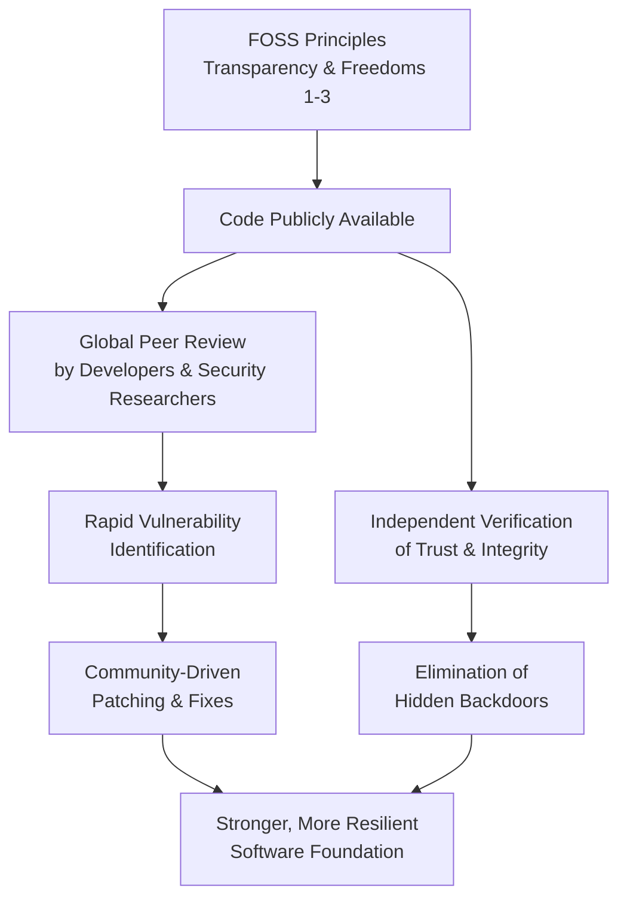

      

<h3 align="center">WELCOME TO</h3>
<h1 align="center">SR CYBER LABS</h1>
<h3 align="center">PRECISION IN EXECUTION - SUPREMACY IN IMPACT</h3>

  

    

  

<h1 align="center">FREE AND OPEN SOURCE SOFTWARE: THE INDISPENSABLE ENGINE OF SECURE DIGITAL EVOLUTION AND DEMOCRATIC SOCIETAL TRANSFORMATION.</h1>

 

**Introduction:** Free and Open Source Software (FOSS) represents far more than a collaborative development methodology; it constitutes a fundamental architectural and philosophical principle for the 21st century. It embodies a paradigm shift characterized by radical transparency, decentralized peer production, and uncompromising user sovereignty. This framework serves a dual role as both the cornerstone of secure, resilient digital infrastructure and the primary engine for equitable, democratic societal transformation. By guaranteeing essential freedoms and fostering global peer review, FOSS provides a unique and scalable response to escalating cybersecurity threats while simultaneously democratizing access to transformative technology, thereby reshaping economic, social, and political landscapes globally. This document details the mechanisms, impacts, strategic imperatives, and challenges of FOSS, arguing for its indispensable role in building a secure and equitable digital future.

 

**I. Foundational Principles - The Bedrock of Freedom and Security:** The architectural integrity of FOSS is defined by four non-negotiable freedoms, as codified by the Free Software Foundation. These freedoms are operationalized through licenses (e.g., GPL, MIT, Apache) that establish a transparent development continuum. Crucially, "free" refers to *liberty* (libre), not price (gratis), though the economic benefits are a consequential advantage.

| Freedom | Right | Security & Societal Implication |
| :--- | :--- | :--- |
| **Freedom 0** | To run the program for any purpose. | Ensures user control and prevents vendor-imposed restrictions on use. |
| **Freedom 1** | To study how the program works and access its source code. | Enables security auditability, trust verification, and educational access. |
| **Freedom 2** | To redistribute copies. | Facilitates knowledge sharing and reduces barriers to access. |
| **Freedom 3** | To distribute modified versions. | Drives innovation, allows customization, and enables community patching. |

This framework inherently dismantles the security blind spots endemic to proprietary models, where code obscurity impedes independent verification and creates systemic vulnerabilities. In the FOSS model, knowledge is treated as a shared commons, transforming software into inspectable public infrastructure and enabling continuous security validation through global scrutiny.

 

**II. Demonstrated Impact - Security, Innovation, and Societal Transformation:**

**A. Security Through Collective Vigilance & Transparency:** The "many eyes" hypothesis, while not automatic, creates a powerful environment for security hardening when combined with structured governance.

*   **Auditable Code:** Global expert scrutiny enables rapid vulnerability identification and patching (e.g., the coordinated response to the Heartbleed vulnerability in OpenSSL).
*   **Trust Minimization:** Eliminates hidden attack surfaces and backdoors. Privacy-critical tools like Signal and VeraCrypt leverage this transparency to provide verifiable security guarantees.
*   **Standardized Hardening:** FOSS enables reproducible security frameworks (e.g., SELinux for mandatory access controls, OpenSSH for secure communication) and specialized distributions like Kali Linux for penetration testing.
*   **Supply Chain Integrity:** The generation of a verifiable Software Bill of Materials (SBOM) is intrinsic to FOSS, a critical factor for securing complex software supply chains against compromise.

The following flowchart visualizes the FOSS security advantage cycle:

**B. Accelerated Innovation & Economic Democratization:**

*   **Collaborative Velocity:** Open development models often outpace proprietary alternatives. The Linux kernel (powering 100% of the world's supercomputers, the vast majority of cloud infrastructure, and Android), Kubernetes, and the Apache Web Server exemplify how global collaboration drives rapid feature development and robust problem-solving.
*   **Vendor-Neutral Standards:** FOSS underpins critical open standards (e.g., TLS/SSL, powered by projects like OpenSSL, and decentralized protocols like ActivityPub), preventing vendor lock-in and ensuring universal interoperability.
*   **Cost Efficiency & Access:** FOSS eliminates prohibitive license fees. LibreOffice saves governments and enterprises billions globally, WordPress powers over 40% of all websites, and Blender provides a professional-grade alternative for animation and VFX. This removes financial barriers for startups, educational institutions (using R, Jupyter, Moodle), and developing nations.
*   **Knowledge Transfer:** Platforms like GitHub host vast repositories of FOSS projects, creating living libraries for security best practices and global workforce development.

**C. Societal Transformation & Empowerment:**

*   **Digital Sovereignty:** Nations leverage FOSS to reduce foreign dependency and secure critical infrastructure (e.g., France's migration to LibreOffice, saving an estimated €400M annually).
*   **Guardian of Digital Rights:** FOSS empowers user autonomy: Tor protects privacy under repressive regimes; licenses like GPLv3 explicitly prohibit surveillance and Digital Restrictions Management (DRM) abuses; federated platforms (Mastodon, Pixelfed) offer alternatives to corporate-controlled social media.
*   **Glocalized Impact:** FOSS enables context-specific solutions: OpenMRS tailors electronic medical records for clinics in low-infrastructure settings; Sugar Labs delivers offline education to millions of students.
*   **Ethical Technology Democratization:** Open-source AI/ML frameworks (TensorFlow, PyTorch) and models (Llama 2) reduce the concentration of power, enable bias auditing, and provide access to researchers excluded from proprietary API ecosystems.

 

**III. Strategic Imperatives - Securing the Future:**

To harness the full potential of FOSS, deliberate and strategic action is required across multiple domains.

| Imperative | Key Actions |
| :--- | :--- |
| **Fortifying Infrastructure & Sovereignty** | Mandate FOSS in critical government and healthcare systems. Integrate SBOM verification (SPDX, Sigstore) and promote FOSS foundations for AI, IoT (Zephyr RTOS), and cloud-native technologies. |
| **Amplifying Cyber Defense** | Leverage Infrastructure-as-Code (Ansible, Terraform) for auditable patching. Expand community threat intelligence sharing via platforms like MISP. Architect systems with privacy and security by design (Tails OS, Signal Protocol). |
| **Ensuring Equitable Access** | Bridge the digital divide with offline-capable, low-resource tools. Democratize AI development by supporting open models and datasets. Champion FOSS-driven open standards for decentralized identity and communication. |

**IV. Critical Challenges and Mitigation Frameworks:**

The FOSS ecosystem faces significant challenges that threaten its long-term health and security.

**A. Ensuring Sustainability:** Many critical projects (e.g., OpenSSL, log4j) are maintained by a small number of under-resourced volunteers.
*   **Mitigation:** Implement tiered funding models (e.g., OpenSSF Alpha-Omega). Mandate that enterprises and governments allocate a minimum percentage (e.g., 5%) of IT/security budgets to supporting critical FOSS dependencies. Utilize SBOM-driven risk analysis to prioritize funding.

**B. Strengthening Governance and Compliance:** License compliance and contribution integrity require proactive management.
*   **Mitigation:** Employ automated license scanning tools (FOSSA, Snyk). Enforce contribution policies like the Developer Certificate of Origin (DCO) and rigorous code review. Adopt standardized governance frameworks like OpenChain ISO/IEC 5230.

**C. Navigating Ethical Commercialization:** The rise of "open-core" models can lead to "enshitification," where core FOSS features are degraded to push proprietary offerings.
*   **Mitigation:** Validate that commercial extensions do not weaken the core project. Support patent risk mitigation initiatives like the Open Invention Network (OIN). Uphold strict Codes of Conduct to maintain inclusive and healthy communities.

**V. Architecting a Secure and Equitable Digital Future:** Free and Open Source Software has irrevocably transitioned from an ideological movement to an operational and societal necessity. Its core principles of transparency, collaboration, and user freedom provide the only scalable framework capable of addressing the dual challenges of securing an exponentially expanding digital attack surface and ensuring equitable access to technology.

The security advantages are foundational, enabling verifiable trust through collective vigilance and inherently auditable supply chains. Simultaneously, FOSS acts as the engine of democratic innovation, dismantling economic barriers, preserving digital rights, and empowering local adaptation.

Securing this indispensable engine demands concerted action: **sustainable investment** in critical projects, the adoption of **robust governance** and security practices, **active stewardship** from the global technology community, and the **integration of FOSS-first policies** into government procurement and digital sovereignty strategies. FOSS is more than software; it is the foundational protocol for a resilient, secure, and equitable digital ecosystem. Embracing its principles is not merely strategic—it is existential for fostering trustworthy technological progress that serves all of humanity. The path forward is open, collaborative, and demands our unwavering commitment.

  

<h2 align="center">STAY TUNED FOR THE LATEST UPDATES!</h2>

  

    

