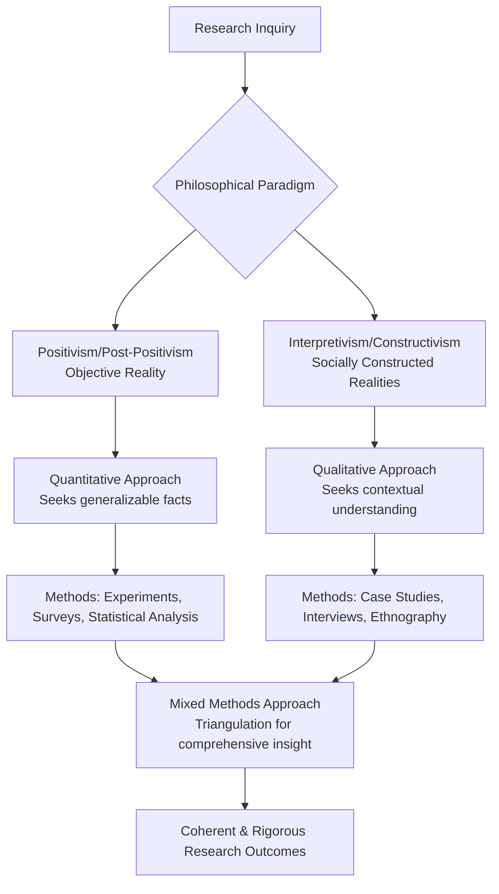

      

<h3 align="center">WELCOME TO</h3>
<h1 align="center">SR CYBER LABS</h1>
<h3 align="center">PRECISION IN EXECUTION - SUPREMACY IN IMPACT</h3>

  

    

  

<h1 align="center">THE NEXT-GENERATION RESEARCHER’S COMPENDIUM: BRIDGING PHILOSOPHICAL RIGOR AND TRADITIONAL METHODOLOGY IN MODERN SCHOLARSHIP.</h1>

  

**TABLE OF CONTENTS:**

 

**INTRODUCTION**  
The Nature and Purpose of Research  

 

**BLOCK I: RESEARCH FUNDAMENTALS**  
**UNIT 1: FOUNDATIONS OF RESEARCH**  
1.1 Nature, Definition, and Objectives of Research  
1.2 Significance of Research in Knowledge Development  
1.3 Scientific Method and Research Approaches  
1.4 Types of Research (Basic, Applied, Experimental, Descriptive)  
1.5 Ethical Principles in Research  

**UNIT 2: LIBRARY AND INFORMATION SCIENCE (LIS) RESEARCH**  
2.1 LIS as an Interdisciplinary Field  
2.2 Research Significance in LIS  
2.3 Key Research Areas in LIS  

**UNIT 3: RESEARCH METHODS**  
3.1 Survey Research  
3.2 Case Study Method  
3.3 Experimental Research  
3.4 Focus Group Techniques  
3.5 Comparative Analysis of Methods  

 

**BLOCK II: RESEARCH DESIGN & PLANNING**  
**UNIT 4: RESEARCH PROBLEM FORMULATION**  
4.1 Identifying Research Gaps  
4.2 Defining Research Questions  
4.3 Scope and Delimitations  

**UNIT 5: LITERATURE REVIEW**  
5.1 Purposes of Literature Survey  
5.2 Using Libraries and Electronic Resources  
5.3 Information Retrieval Systems  
5.4 Abstracting and Documentation  

**UNIT 6: HYPOTHESIS DEVELOPMENT**  
6.1 Formulating Testable Hypotheses  
6.2 Null and Alternative Hypotheses  
6.3 Hypothesis Testing Procedures  
6.4 Type I & Type II Errors  

**UNIT 7: RESEARCH DESIGN**  
7.1 Principles of Research Design  
7.2 Exploratory Designs  
7.3 Descriptive Designs (Cross-Sectional, Longitudinal)  
7.4 Experimental Designs  
7.5 Research Proposal Writing  

 

**BLOCK III: DATA COLLECTION & MEASUREMENT**  
**UNIT 8: DATA COLLECTION METHODS**  
8.1 Primary vs. Secondary Data  
8.2 Observation Techniques  
8.3 Interview Methods  
8.4 Library Records and Archival Sources  

**UNIT 9: QUESTIONNAIRE DESIGN**  
9.1 Principles of Questionnaire Construction  
9.2 Structured vs. Unstructured Questionnaires  
9.3 Scaling Techniques (Likert, Semantic Differential)  
9.4 Pretesting and Validation  

**UNIT 10: SAMPLING TECHNIQUES**  
10.1 Sampling Fundamentals  
10.2 Probability Sampling Methods  
10.3 Non-Probability Sampling Methods  

 

**BLOCK IV: DATA ANALYSIS & REPORTING**  
**UNIT 11: DATA PROCESSING & ANALYSIS**  
11.1 Data Preparation and Coding  
11.2 Descriptive Statistics  
11.3 Inferential Statistics  
11.4 Introduction to Statistical Software (SPSS)  

**UNIT 12: RESEARCH REPORTING**  
12.1 Structure of Research Reports  
12.2 Interpretation of Findings  
12.3 Academic Writing Styles (APA, MLA, Chicago)  
12.4 Presentation Techniques  

**UNIT 13: INFORMETRICS**  
13.1 Bibliometrics  
13.2 Scientometrics  
13.3 Webometrics  

 

**Introduction:** Modern scholarship exists at a complex intersection, demanding that researchers ground their investigative endeavors in profound **philosophical rigor** while simultaneously mastering robust, traditional methodology. This dual requirement necessitates a clear articulation of one's assumptions about the nature of reality (ontology) and the theory of knowledge (epistemology) before designing a study that coherently reflects these foundational beliefs. Nowhere is this more critical than in interdisciplinary fields like Library and Information Science (LIS), where inquiries into human information behavior, system design, and resource management must be both intellectually coherent and empirically credible. The primary goal of this compendium is to guide emerging scholars through the complete research lifecycle—from foundational philosophical concepts to final reporting—emphasizing time-tested, rigorous practices. By meticulously aligning research questions with appropriate paradigms and methods, scholars can produce work that is not only methodologically sound but also philosophically defensible and impactful.

**Philosophical Foundations - The Bedrock of Coherent Inquiry:** Every research project is undergirded by a philosophical paradigm—a framework of beliefs that guides the entire investigative process. The journey begins with two pivotal questions:

*   **Ontology:** What is the nature of reality? Does a single, objective reality exist independent of the researcher (realism), or are there multiple, socially constructed realities (relativism)?
*   **Epistemology:** What is the nature of knowledge and the relationship between the knower and the known? Can knowledge be acquired through measurement and discovery (positivism/post-positivism), or must it be interpreted through subjective experience and context (interpretivism/constructivism)?

These assumptions are not academic abstractions; they directly determine the phrasing of research questions, the choice of methods, and the interpretation of results. For instance, a positivist studying information retrieval might design a controlled experiment to measure a system's objective performance, while a constructivist might employ ethnographic methods to understand users' subjective experiences with the same system. Recognizing and explicitly stating one’s paradigm **instills rigor** by ensuring every subsequent design decision is coherent and justifiable. Furthermore, this clarity promotes **ethical and reflexive research**, compelling scholars to consider how their own values and biases (axiology) influence the inquiry. As emphasized in contemporary scholarship, reflexivity about one's philosophical stance is the cornerstone of research that is "methodologically sound, ethically informed, and practically relevant."

The following flowchart illustrates how these philosophical commitments flow into methodological choices:

**The Library and Information Science (LIS) Research Context:** Library and Information Science is inherently interdisciplinary, addressing fundamental problems related to information creation, organization, access, and use. Consequently, LIS scholars must be methodological polymaths, drawing upon a **rich variety of research designs** from the social sciences, computer science, and the humanities. Research areas are diverse, encompassing information retrieval efficacy, archival management practices, the impact of information literacy programs, and the sociotechnical analysis of emerging technologies. This methodological eclecticism is a strength, but it demands a disciplined approach. As noted by Eldredge (2004), familiarity with this range of methods allows researchers to accurately label and situate their work, selecting the optimal approach—be it bibliometric analysis, usability testing, surveys, or ethnography—based on the research question and context, not methodological convenience.

Traditionally, LIS inquiry has often relied on applied methods such as **case studies, program evaluations, and surveys**, reflecting the field's pragmatic orientation toward solving real-world problems. The commitment uniting all LIS research is the use of sound, paradigm-aligned methods to answer critical questions about information in society, ensuring findings are both philosophically coherent and actionable for practitioners and policymakers.

**A Comparative Overview of Research Methods:** The selection of a research methodology is a direct consequence of the chosen philosophical paradigm and the specific research question. The following table delineates the primary methods available to scholars, particularly in LIS.

| Method | Primary Approach | Purpose | Typical Data Collection | Strengths | Limitations |
| :--- | :--- | :--- | :--- | :--- | :--- |
| **Survey** | Quantitative | To collect standardized data from a sample to describe attitudes, trends, or behaviors. | Structured questionnaires (online, phone, mail). | Generalizability to a population if sampled correctly; efficient for large samples. | Can lack depth; prone to non-response bias; may miss social context. |
| **Experiment** | Quantitative | To establish cause-and-effect relationships by manipulating variables. | Controlled conditions with pre-/post-test measurements. | High internal validity; strong causal inference. | Can have low ecological validity; ethical/manipulation constraints. |
| **Case Study** | Qualitative | In-depth exploration of a single instance or system in its real-world context. | Interviews, documents, observations, artifacts. | Rich, contextual detail; suitable for complex, contemporary phenomena. | Limited generalizability; findings specific to the case. |
| **Interview/Focus Group** | Qualitative | To explore complex experiences, opinions, and motivations in depth. | Semi-structured or open-ended guides; audio recordings. | Provides deep insight and nuanced understanding. | Time-consuming to analyze; small sample sizes; interviewer bias. |
| **Content Analysis** | Mixed | To systematically quantify and analyze the presence of themes in textual or visual data. | Documents, media, archives, digital content. | Unobtrusive; handles large volumes of data; can be quantitative or qualitative. | Limited to recorded information; context may be missing. |
| **Bibliometrics** | Quantitative | To quantitatively analyze scholarly communication using publication patterns. | Citation databases, publication metadata. | Maps intellectual landscapes; measures impact; tracks trends. | Can be misused for evaluation; favors established fields/formats. |

**The Research Lifecycle - From Design to Dissemination:** A robust research design is the strategic blueprint for answering the research question. It is a comprehensive plan that ensures the study is valid, reliable, and ethical.

**1. Problem Formulation & Literature Review:** The process initiates with identifying a significant research gap through a critical synthesis of existing literature. This involves leveraging library resources and information retrieval systems to conduct a thorough literature review, which informs the development of a focused research question or a testable hypothesis (null and alternative).

**2. Design & Planning:** The researcher selects a specific design type—exploratory, descriptive (e.g., cross-sectional or longitudinal surveys), or experimental—that aligns with the philosophical paradigm. This stage includes planning for sampling (probability vs. non-probability techniques), data collection instruments (e.g., validated questionnaires, interview protocols), and a meticulous consideration of ethical principles.

**3. Data Collection & Analysis:** Data is gathered following the predefined protocol. Quantitative data undergoes processing, descriptive analysis (e.g., means, standard deviations), and inferential statistical testing (e.g., t-tests, regression) using software like SPSS or R. Qualitative data is transcribed, coded, and analyzed for themes and patterns using techniques like thematic analysis or grounded theory, often aided by software like NVivo. The principle of **triangulation**—using multiple methods or data sources—is key to enhancing validity and credibility at this stage.

**4. Reporting & Dissemination:** The final phase involves communicating findings in a standardized academic structure (Abstract, Introduction, Methods, Results, Discussion). Adherence to a recognized citation style (e.g., APA, MLA, Chicago) is mandatory. Effective reporting is characterized by clarity, objectivity, a thoughtful interpretation of results in light of the literature, an honest discussion of limitations, and a presentation that is tailored to the target audience, whether through journal publication, conference presentation, or professional report.

**The Enduring Value of Rigorous Tradition:** This compendium articulates a framework for next-generation scholarship that is both timeless and urgently relevant. By championing a research process that is consciously grounded in philosophical clarity and methodological rigor, we empower scholars to produce work that is reliable, reproducible, and profoundly meaningful. This traditional R&D approach, which may eschew fleeting technological buzzwords, remains the immutable foundation of credible academic contribution. It is through the disciplined application of these principles that researchers can truly bridge the enduring tenets of rigorous inquiry with the evolving challenges of modern scholarship, thereby generating knowledge that meaningfully advances fields like Library and Information Science and beyond.

  

<h2 align="center">STAY TUNED FOR THE LATEST UPDATES!</h2>

  

    

